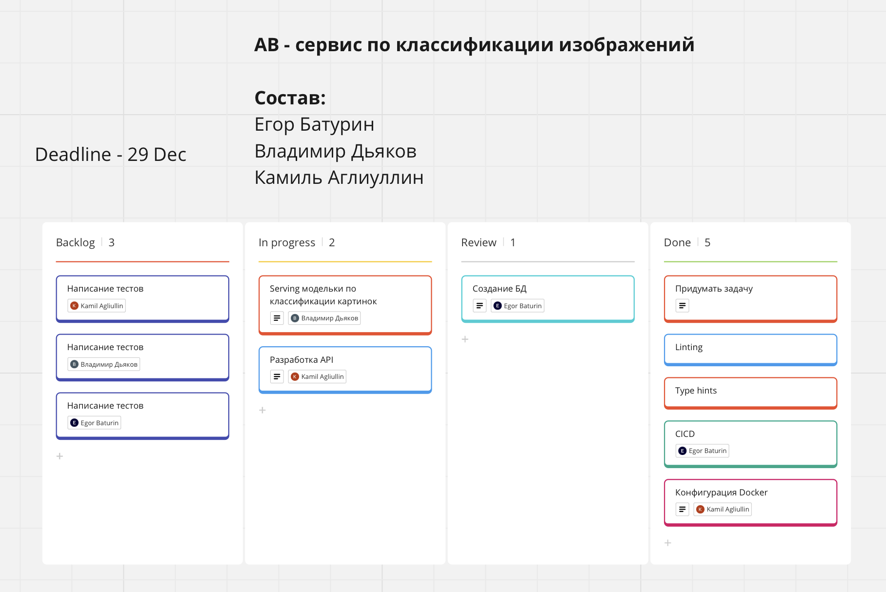

# Разработка в команде
## Application for Image Classification (AIC)
#### Состав: Егор Батурин, Камиль Аглиуллин, Владимир Дьяков

### Распределение ролей

### Процесс работы
- Скрин нашей kanban таблички со статусом задач

- Встречи в Talk
- Обсуждения в командном чате
- Code review

### Результат
- Документация по api - [openapi.yml](assets/documentation/openapi.yaml)
- Документация по методам в проекте - [pdoc html documentation](assets/documentation/aic/index.html)
   - Для открытия документации api по методам в проекте нужно клонировать проект.

### Итоги
   - Что получилось хорошо?
     - Быстро подхватили задачки
     - Реализовали интересную идею по проекту
     - Качественный код с небольшим количеством фиксов в МР
   - Где возникли сложности?
     - Не успели реализовать некоторые фичи из-за нехватки времени
   - Как совместную работу можно улучшить?
     - Ставить четкие дедлайны по каждой задаче в таком коротком проекте

### Запуск

``docker-compose up --build``

### [Демонстрация работы](https://tinkoff.ktalk.ru/recordings/KEFKYI5veEmPJjVd5JsG)
